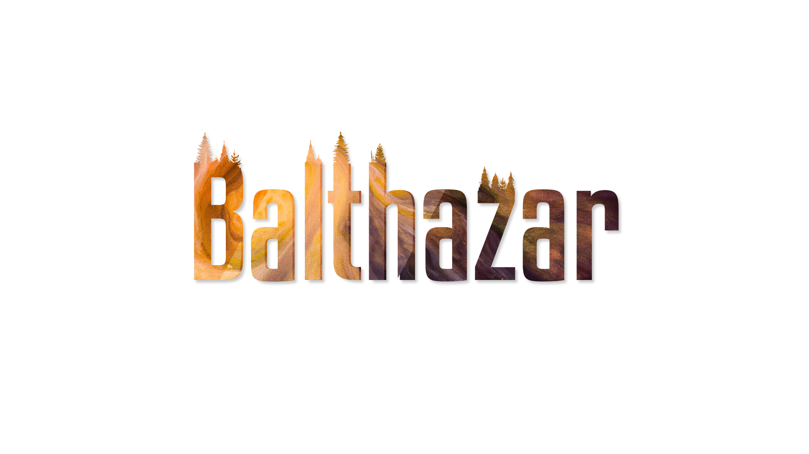

Multiplayer real-time strategy for up to 8 players. A procedurally-generated map, hundreds of star systems, science, upgrades and, most importantly, warfare!

Currently working on this in my free time.

*This project has no relation to the band Balthazar. It is named after Balthazar, the god of war, fire and challenge in the Guild Wars series.*
